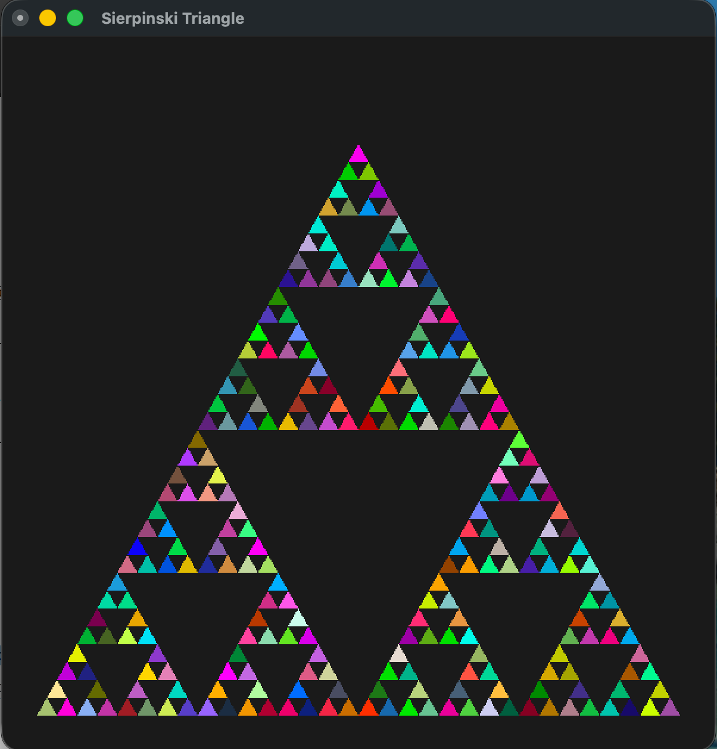
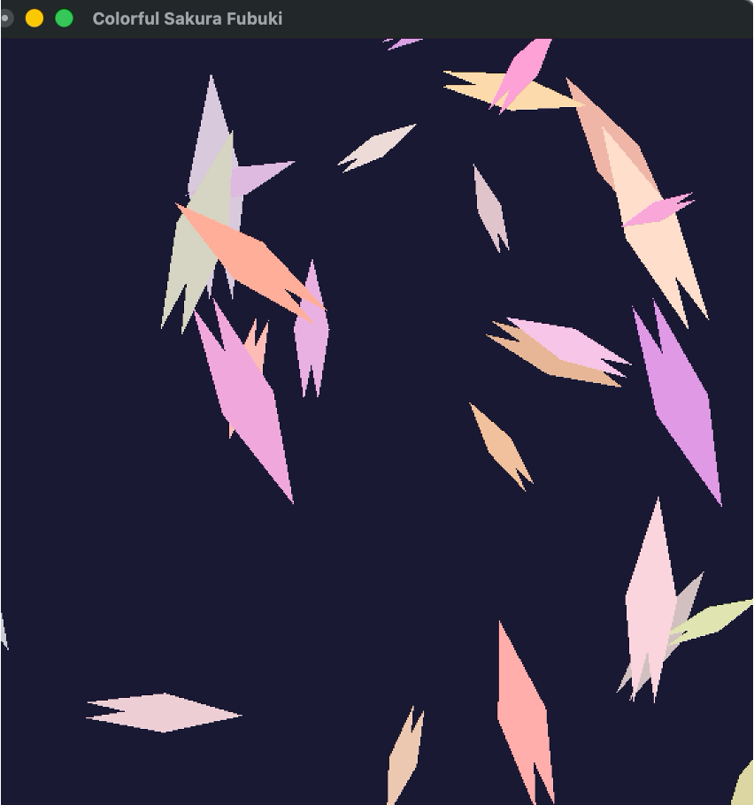

# 2025年度CG基礎（GC23304）課題

このリポジトリは、筑波大学のCG基礎(GC23304)の授業で作成した課題をまとめたものです。
毎週の課題で学んだことや作成した成果物を記録していきます。

---

## Week 1: 再帰による図形の描画

### 学んだ内容（コマンド）
- **OpenGL/GLUTの基本設定**:
  - `glutInit`: GLUTの初期化
  - `glutCreateWindow`: ウィンドウの作成
  - `glutDisplayFunc`: 描画コールバック関数の登録
  - `gluOrtho2D`: 2次元の正投影変換の設定
  - `glutMainLoop`: GLUTのメインループ開始
- **図形描画**:
  - `glBegin(GL_TRIANGLES)`: 三角形の描画開始
  - `glColor3f`: 描画色の設定
  - `glVertex2f`: 頂点座標の指定
  - `glEnd()`: 描画の終了
- **再帰関数の活用**:
  - Pythonの再帰関数を用いて、フラクタル図形であるシェルピンスキーのギャスケットをレベル指定で描画する方法を学びました。

### 作成した課題
学んだコマンドと再帰関数の知識を活かして、シェルピンスキーのギャスケットを描画するプログラムを作成しました。再帰のレベルに応じて複雑さが変化します。

### 実行結果

---

## Week 2: アニメーションと座標変換

### 学んだ内容（コマンド）
- **アニメーション**:
  - `glutTimerFunc`: 一定時間ごとに関数を呼び出し、アニメーションを実現
  - `glutSwapBuffers`: ダブルバッファリングを使い、スムーズな描画を行う
- **座標変換**:
  - `glPushMatrix` / `glPopMatrix`: 座標変換の状態を保存・復元
  - `glTranslatef`: 平行移動
  - `glRotatef`: 回転
  - `glScalef`: 拡大・縮小
- **ディスプレイリスト**:
  - `glNewList` / `glEndList`: 繰り返し描画する図形をコンパイルし、高速化
  - `glCallList`: コンパイルした図形を呼び出して描画

### 作成した課題
座標変換（移動・回転・拡大縮小）を各オブジェクトに個別に適用し、タイマー関数でそれらを連続的に更新することで、桜の花びらがひらひらと舞い散るアニメーションを作成しました。ディスプレイリストを用いることで、多数のオブジェクトを効率的に描画しています。

### 実行結果

---

## Week 3: 3Dシーンの構築と光、シェーディング

### 学んだ内容
- **3D座標系と視点設定**:
  - `gluPerspective`: 透視投影変換を設定し、奥行きのあるシーンを表現。
  - `gluLookAt`: カメラの位置、注視点、上方向を定義し、視点を制御。
- **ライティングとマテリアル**:
  - `glEnable(GL_LIGHTING)`: 照明を有効化。
  - `glLightfv`: 光源の位置や色（環境光、拡散光、鏡面光）を設定。
  - `glMaterialfv`: 物体の材質（反射特性）を設定し、リアルな質感を表現。
- **シェーディング**:
  - `glShadeModel(GL_SMOOTH)`: スムーズシェーディングを適用し、滑らかな陰影を実現。
- **深度テスト**:
  - `glEnable(GL_DEPTH_TEST)`: 物体の前後関係を正しく処理し、隠れた面が描画されないようにする。
- **ブレンド処理**:
  - `glEnable(GL_BLEND)` と `glBlendFunc`: 半透明なオブジェクトやグロー（ブルーム）効果を実現。

### 作成した課題
3D空間にメリーゴーランドを構築し、ティーポットが回転しながら上下するアニメーションを作成しました。時間帯（昼、夕方、夜）に応じて照明の色や空の色が変化する機能を実装し、さらにLEDライトが点灯する部分にはブルーム効果を加えて、光がにじんで見えるような視覚効果を実現しました。キーボード操作で時間帯の変更やブルーム効果のオン・オフが可能です。